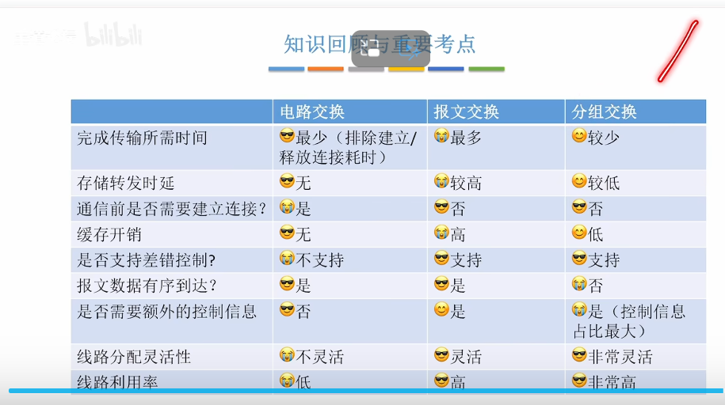
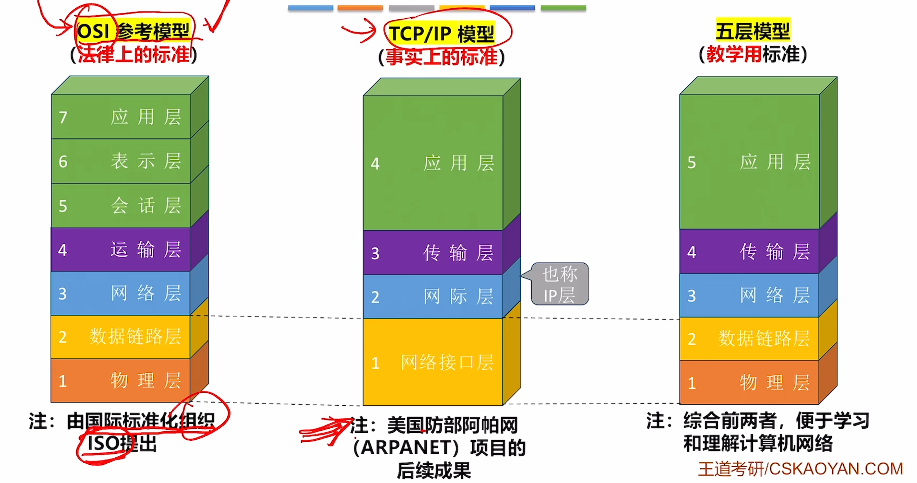
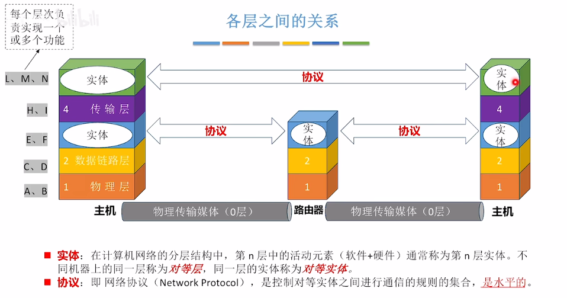
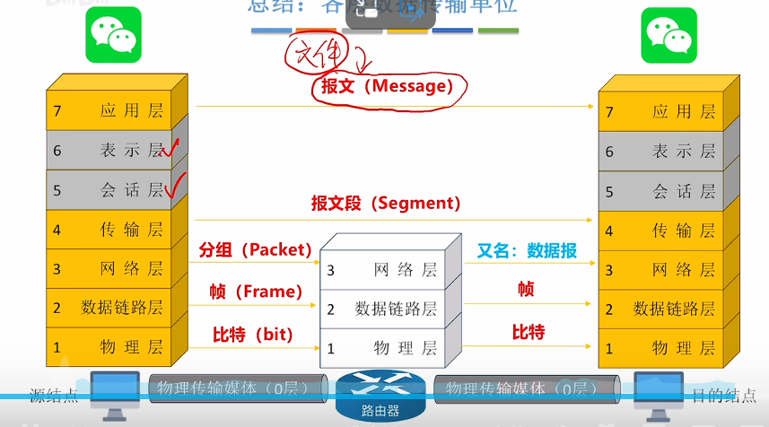
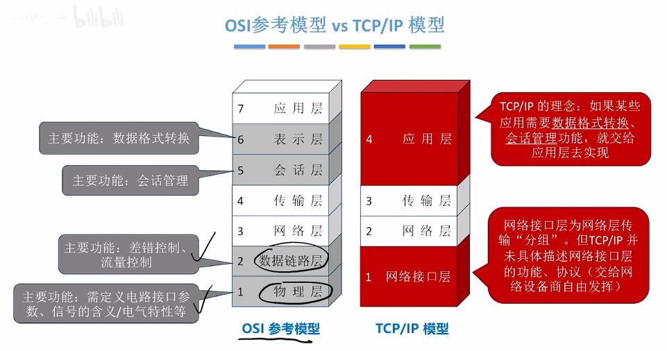
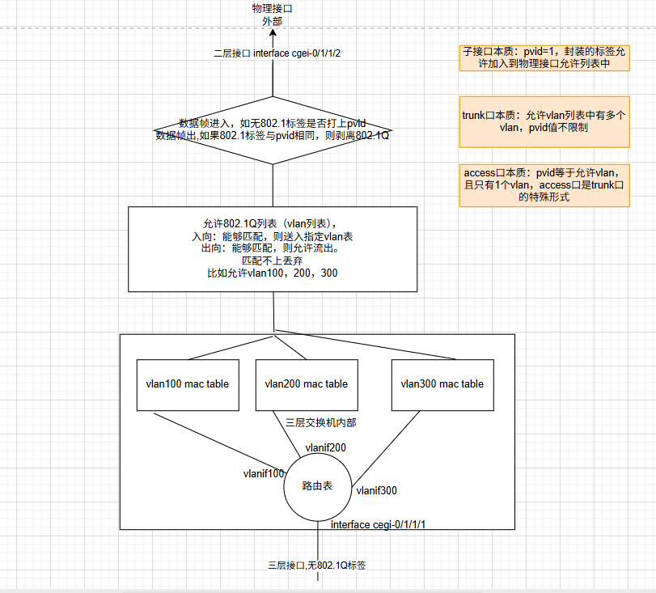

# 计算机网络 - 第1章 网络层次结构

&gt; 阅读使人充实，会谈使人敏捷，写作与笔记使人精确。  
&gt; —— 培根

---

## 目录
1. [网络体系架构](#网络体系架构)
   - [交换技术](#交换技术)
   - [网络分类](#网络分类)
   - [网络性能指标](#网络性能指标)
2. [网络分层结构](#网络分层结构)
   - [OSI参考模型](#osi参考模型)
   - [TCP/IP模型](#tcpip模型)
   - [交换机本质](#交换机本质)

---

## 网络体系架构

&gt; 文档中包含网络架构示意图

计算机网络为边缘设备提供**"交换服务"**

### 计算机网络功能
- **数据通信**：实现计算机之间的数据传输
- **资源共享**：共享硬件、软件、数据资源
- **分布式处理**：将任务分散到多台计算机处理
- **提高可靠性**：通过冗余提高系统可靠性
- **负载均衡**：合理分配网络负载

---

### 交换技术

阿帕网（ARPANET）设计参考了**电路交换**和**电报交换**，提出了**分组交换**。

#### 1. 电路交换（Circuit Switching）

| 特点 | 说明 |
|-----|------|
| 独占线路 | 通信双方独占物理链路 |
| 灵活性差 | 线路资源利用率低 |
| 无法检错 | 中间设备无法检查传输差错 |
| 建立开销 | 需要建立连接的时间开销 |
| 适用场景 | 低频次、大数据量传输 |

#### 2. 报文交换（Message Switching）

| 特点 | 说明 |
|-----|------|
| 报文结构 | 包含控制信息 + 用户数据，组成"报文"（Message） |
| 无需连接 | 不需要预先建立连接 |
| 线路共享 | 物理线路不会被独占 |
| 存储转发 | 采用存储转发机制，具有差错检查功能 |
| 缺点 | 中间节点需全面存储后才能转发；报文越长越容易出错，需要重传 |

#### 3. 分组交换（Packet Switching）

| 特点 | 说明 |
|-----|------|
| 定长分组 | 以定长报文（分组）形式转发 |
| 分组结构 | 首部信息（控制）+ 用户数据 |
| 典型设备 | 路由器是典型的"分组交换机" |
| 缺点 | 控制信息增加；可能出现失序等问题需要额外处理 |

&gt; 文档中包含三种交换方式的对比示意图（image2 - image5）

---

### 网络分类

&gt; 文档中包含网络分类示意图（image6）

| 分类标准 | 类型 | 说明 |
|---------|------|------|
| **覆盖范围** | PAN（个域网） | 个人设备互联 |
| | LAN（局域网） | 局部区域网络 |
| | MAN（城域网） | 城市范围网络 |
| | WAN（广域网） | 广域范围网络 |
| **拓扑结构** | 总线型、星型、环型、网状型 | — |
| **传输介质** | 有线网络、无线网络 | — |

&gt; **注意**：局域网实现方式是以太网，所以以太网成了局域网的代名词。1990年代以太网技术逐渐取代令牌环网，早期叫网桥，后网桥就是交换机。

---

### 网络性能指标

&gt; 文档中包含性能指标示意图（image7）

| 性能指标 | 说明 |
|---------|------|
| **信道** | 发送信道、接收信道 |
| **信道速率** | 单位时间内传输的比特数 |
| **带宽** | 信道所能传输的最高频率与最低频率之差 |
| **吞吐量** | 单位时间内实际传输的数据量 |
| **时延** | 发送时延 + 传播时延 + 处理时延 |
| **时延带宽积** | 传播时延 × 带宽，表示链路上有多少bit，用于设计最短帧长 |
| **往返时延（RTT）** | 数据从发送方到接收方再返回的总时间 |
| **信道利用率** | 信道被有效利用的时间比例 |

---

## 网络分层结构

### 核心概念

| 术语 | 定义 |
|-----|------|
| **协议（Protocol）** | 约束对等实体之间的工作语言，是**水平的** |
| **PDU（协议数据单元）** | 协议数据单元，每层的数据单位 |

---

### OSI参考模型

| 层次 | 名称 | 主要功能 |
|:----:|------|---------|
| 7 | **应用层** | 具体的应用服务（HTTP、FTP、SMTP等） |
| 6 | **表示层** | 数据格式转换、加密解密、压缩解压 |
| 5 | **会话层** | 建立、管理、终止会话 |
| 4 | **传输层** | 端到端通信（进程间），复用与分用 |
| 3 | **网络层** | 分组路由选择、拥塞控制、异构网络互联 |
| 2 | **数据链路层** | 成帧、差错控制、流量控制 |
| 1 | **物理层** | 电气特性、编码、比特传输 |

---

### TCP/IP模型

#### 设计哲学

&gt; **上层校验全局正确，下层的差错控制必然成立**

在TCP/IP中：
- **网络层**：尽量而为（Best Effort），不复杂校验，专心转发
- 称之为**"无连接、不可靠"**（相对电路交换而言）
- **由端节点主机负责校验**，而非网络中间节点

| TCP/IP层次 | 对应OSI层次 | 功能 |
|-----------|------------|------|
| 应用层 | 应用层+表示层+会话层 | 应用协议 |
| 传输层 | 传输层 | TCP/UDP |
| 网际层 | 网络层 | IP协议 |
| 网络接口层 | 数据链路层+物理层 | 网络接入 |

---

### 交换机本质

&gt; 文档中包含交换机工作原理示意图

**理解**：交换机的本质是一个多端口的网桥，工作在数据链路层，根据MAC地址进行帧的转发和过滤。

---

## 总结

| 对比项 | OSI模型 | TCP/IP模型 |
|-------|---------|-----------|
| 层次数 | 7层 | 4层 |
| 理论性 | 理论完整 | 实践导向 |
| 可靠性 | 每层都有差错控制 | 网络层不可靠，端到端可靠 |
| 实际应用 | 参考模型 | 实际运行的互联网协议 |

---

*本文档整理自计算机网络课程第1章网络层次结构讲义*
