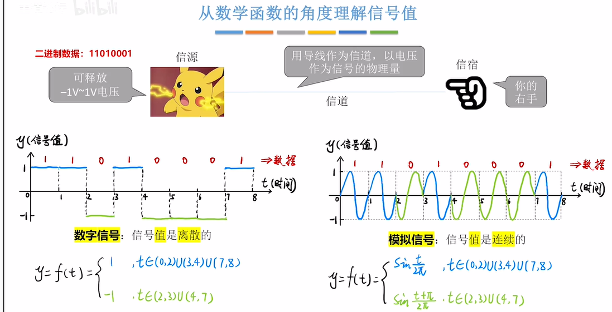
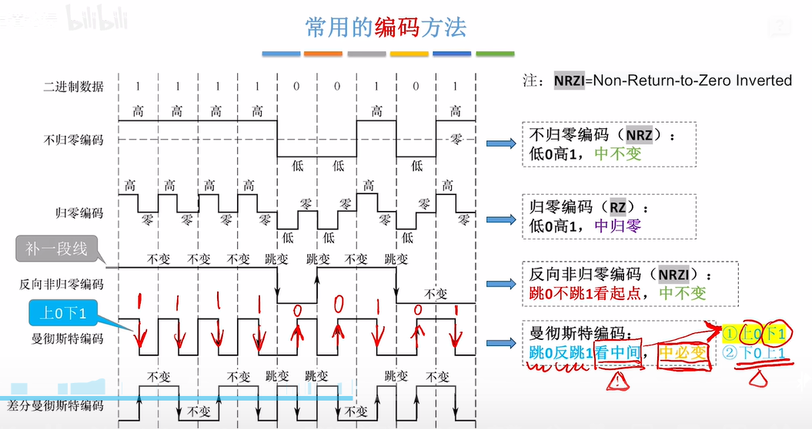

# 计算机网络 - 第2章 物理层

---

## 目录
1. [数字信号与模拟信号](#数字信号与模拟信号)
2. [奈奎斯特定理和香农定理](#奈奎斯特定理和香农定理)
3. [编码与调制](#编码与调制)
4. [传输介质](#传输介质)
   - [双绞线](#双绞线)
   - [同轴电缆](#同轴电缆)
   - [以太网命名规范](#以太网命名规范)
   - [无线传输介质](#无线传输介质)
5. [物理层设备](#物理层设备)

---

## 数字信号与模拟信号

&gt; 文档中包含信号波形示意图

.

.

- **模拟信号**：连续变化的信号
- **数字信号**：离散的信号，只有有限个离散值

---

## 奈奎斯特定理和香农定理

&gt; 文档中包含定理公式示意图（image3）

### 奈奎斯特定理（Nyquist Theorem）
在无噪声的理想信道中，码元传输的最高速率与信道带宽的关系：

$$C = 2W \log_2{M}$$

其中：
- $C$：信道容量（bps）
- $W$：信道带宽（Hz）
- $M$：信号电平数

### 香农定理（Shannon Theorem）
在有噪声的信道中，信道容量与信噪比的关系：

$$C = W \log_2{(1 + S/N)}$$

其中：
- $S/N$：信噪比（Signal-to-Noise Ratio）
- 信噪比通常用分贝(dB)表示：$10 \log_{10}(S/N)$

---

## 编码与调制

&gt; 文档中包含多种编码调制方式的示意图（image4 - image8）

### 常见编码方式
| 编码方式 | 特点 |
|---------|------|
| 不归零编码 (NRZ) | 简单，但存在直流分量，无法自同步 |
| 曼彻斯特编码 | 每位中间有跳变，自带时钟，效率50% |
| 差分曼彻斯特编码 | 位开始处有跳变表示0，无跳变表示1 |
| 4B/5B编码 | 每4位映射为5位，效率80% |

### 调制方式
- **调幅 (ASK)**：用载波幅度变化表示数据
- **调频 (FSK)**：用载波频率变化表示数据
- **调相 (PSK)**：用载波相位变化表示数据
- **正交幅度调制 (QAM)**：ASK与PSK的结合

---

## 传输介质

### 双绞线

#### 双绞线中8根线的作用（以100M/1000M为例）

在以太网中，这4对线各司其职，通常橙、绿对负责数据传输，蓝、棕对常用于PoE供电或备份。

| 线序 | 颜色 | 功能 | 引脚 |
|-----|------|------|------|
| 1 | 橙白 | 发送数据+ (TX+) | 第1脚 |
| 2 | 橙 | 发送数据- (TX-) | 第2脚 |
| 3 | 绿白 | 接收数据+ (RX+) | 第3脚 |
| 4 | 蓝 | 备用/PoE+ | 第4脚 |
| 5 | 蓝白 | 备用/PoE- | 第5脚 |
| 6 | 绿 | 接收数据- (RX-) | 第6脚 |
| 7 | 棕白 | 备用/PoE+ | 第7脚 |
| 8 | 棕 | 备用/PoE- | 第8脚 |

#### 网络速率与线芯使用

| 网络类型 | 使用线芯 | 说明 |
|---------|---------|------|
| **10M/100M网络** | 1、2、3、6 | 仅使用4根芯线进行双向数据传输 |
| **1000M（千兆）网络** | 全部8根 | 8根芯线全部用于数据双向传输 |

&gt; 文档中包含双绞线结构示意图（image9）

---

### 同轴电缆

&gt; 文档中包含同轴电缆结构示意图（image10 - image12）

| 类型 | 特性阻抗 | 应用场景 |
|-----|---------|---------|
| 基带同轴电缆 (50Ω) | 50Ω | 数字传输，如以太网 |
| 宽带同轴电缆 (75Ω) | 75Ω | 模拟传输，如有线电视 |

---

### 以太网命名规范

&gt; 文档中包含以太网命名规则示意图（image13）

以太网命名格式：**&lt;速率&gt;&lt;信号类型&gt;&lt;介质类型&gt;**

| 命名 | 含义 |
|-----|------|
| 10BASE-T | 10Mbps，基带信号，双绞线 |
| 100BASE-TX | 100Mbps，基带信号，双绞线 |
| 1000BASE-T | 1Gbps，基带信号，双绞线 |
| 10GBASE-T | 10Gbps，基带信号，双绞线 |
| 100BASE-FX | 100Mbps，基带信号，光纤 |
| 1000BASE-SX | 1Gbps，短波长光纤 |

---

### 无线传输介质

&gt; 文档中包含无线传输示意图（image14 - image15）

| 传输方式 | 特点 | 应用场景 |
|---------|------|---------|
| 无线电波 | 全向传播，穿透性强 | 广播、WiFi |
| 微波 | 直线传播，带宽高 | 卫星通信、微波中继 |
| 红外线 | 短距离，直线传播 | 遥控器、短距传输 |
| 激光 | 高带宽，定向性强 | 自由空间光通信 |

**短波通信**：带宽高，但需要中继站进行信号转发。

---

## 物理层设备

&gt; 文档中包含物理层设备示意图（image16 - image19）

| 设备 | 功能 | 工作层次 |
|-----|------|---------|
| **中继器 (Repeater)** | 信号放大与整形，延长传输距离 | 物理层 |
| **集线器 (Hub)** | 多端口中继器，广播式转发 | 物理层 |

### 物理层设备特点
- **工作在OSI模型第1层（物理层）**
- **仅处理比特流**，不涉及帧的识别
- **不进行冲突检测或流量控制**
- **放大信号**以补偿传输损耗

---

## 参考资料

1. [双绞线序详解 - 知乎](https://zhuanlan.zhihu.com/p/583175974)
2. [双绞线序 - 百度百科](https://baike.baidu.com/item/双绞线序)
3. [网线8根线的作用 - 知乎](https://zhuanlan.zhihu.com/p/477632283)

---

*本文档整理自计算机网络课程第2章物理层讲义*
